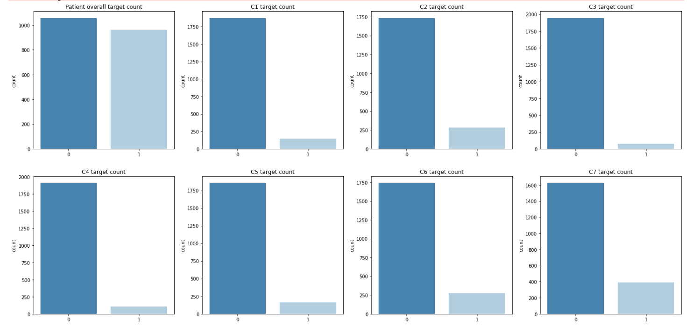

# RSNA-Cervical-Spine-Fracture-IM

**Introduction**

The goal of this project is to add aditional research in the viability of using 3D complied images from .dcm imagery to identify specific Cervical Spine Fractures from CT scan imagery. 

With over 1.5 million spine fractures happening anually in the United States alone, most of which being fractures in the Cervical spine, being able to quickly identify and locate fractures would help healthworkers and enable them to spend less time working with CT imagery.

Many thanks to Anour Stein for providing source code to easily compile the 3D sagittal slices used to train this model. Direct Reference [here](https://www.kaggle.com/code/anoukstein/simplify-data-by-creating-sagittal-slices "here").

**Data Selection**

The Data Collection , Model creation and proccessing are all done via Kaggle Notebooks and can be found [here](https://www.kaggle.com/ijcmian/rsna-deep-learning/edit "here").

The supplied data set gives us 2019 unique cases of CT scans of the Cervical Spine segment, and DICOM imagery for each case. Each case has a unique identifier which corresponds to the supplied csv file which supplies our main features for each case. There are 9 features total, our Unique Instance ID, patient overall , a binary column where 1 signifies that the patient has at least one fracture , and 0 indicates none. the follwoing 7 features are also binary columns in similar vein to the patient_overall , the difference being that they detail specific parts of the Cervical Spine that are fractured (C1-C7)

First, the DICOM images were proccesed utilizing the functional meta data stored in each. We are able to segment the DICOM images in each instance that contain cervical spine imagery, and combine them into 9 different JPEG images per instance. Having multiple instances per case gives us more data to train off of that differ slightly without having to do further preprocessing , such as tilting and other alterations, although these still may be necessary.

This process is repeated for our training data in order to provide an accurate test.

**Methods**

Tools: 

- Numpy and Pandas for data analysis
- matplotlib for imagery
- Tensorflow for model creation
- pydicom for reading and utilization of .dcm files
- Kaggle for dataset and IDE

**Results**

The model was able to accurately predict the correct fractures on our test data, albeit the test sample was relatively small.

**Discussion**

Although the results of this exploration were not perfect, it does provide a quicker training method for data of this size, while also preserving storage space while training the model. In other tests working with training directly from the DICOM images, I was met with long training times, and more often than not maximizing the provided RAM in Kaggle Notebooks. 

Exploring if we can generate more than 9 images should be considered, to give further training points. As well as exploring using Google Cloud AutoAI to provide more computational power.

Wont test well on a hidden data set, due to being trained on a different looking data, May train on smaller portion and split some more in to test to truly test the probability.

**Summary**

The model provides ~70% actual training accuray , while also providing efficient training times and preservation of available storage during training.

